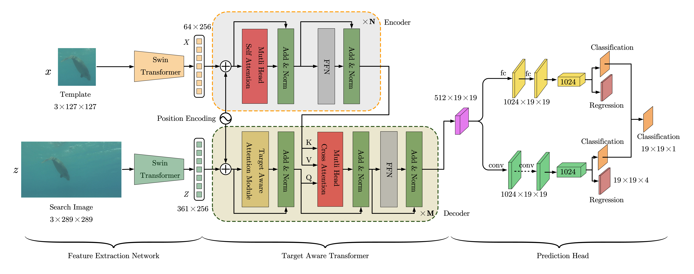

# TATrack
The official implementation for paper "A Target-Aware Transformer for Object Tracking". 



## Installation
* Prepare Anaconda, CUDA and the corresponding toolkits. CUDA version required: 11.3.

* Create a new conda environment and activate it.
```Shell
conda create -n TATrack python=3.7 -y
conda activate TATrack
```

* Install `pytorch` and `torchvision`.
```Shell
conda install pytorch==1.10.0 torchvision==0.11.0 torchaudio==0.10.0 cudatoolkit=11.3 -c pytorch -c conda-forge
# pytorch version: >= 1.9.0 
```

* Install other required packages.
```Shell
pip install -r requirements.txt
```

## Test
* Prepare the datasets: OTB2015, VOT2018, UAV123, GOT-10k, TrackingNet, LaSOT, ILSVRC VID*, ILSVRC DET*, COCO*, and something else you want to test. Set the paths as the following: 
```Shell
├── SparseTT
|   ├── ...
|   ├── ...
|   ├── datasets
|   |   ├── COCO -> /opt/data/COCO
|   |   ├── GOT-10k -> /opt/data/GOT-10k
|   |   ├── ILSVRC2015 -> /opt/data/ILSVRC2015
|   |   ├── LaSOT -> /opt/data/LaSOT/LaSOTBenchmark
|   |   ├── OTB
|   |   |   └── OTB2015 -> /opt/data/OTB2015
|   |   ├── TrackingNet -> /opt/data/TrackingNet
|   |   ├── UAV123 -> /opt/data/UAV123/UAV123
```
* Notes

> i. Star notation(*): just for training. You can ignore these datasets if you just want to test the tracker.
> 
> ii. In this case, we create soft links for every dataset. The real storage location of all datasets is `/opt/data/`. You can change them according to your situation.
>

* Download the pretrained models.
    
    :paperclip: [GOT-10k model]()
    :paperclip: [fulldata model]()


* Set the pretrained model path for the item `pretrain_model_path` in the configuration file, then run shell commands.


* Note that all paths we used here are relative, not absolute. See any configuration file in the `experiments` directory for examples and details.


**GOT-10k**
```Shell
python main/test.py --config experiments/tatrck/test/got10k/sparsett_swin_got10k.yaml
```
**LaSOT**
```Shell
python main/test.py --config experiments/tatrck/test/lasot/sparsett_swin_lasot.yaml
```

**TrackingNet**
```Shell
python main/test.py --config experiments/tatrck/test/trackingnet/sparsett_swin_trackingnet.yaml
```

**UAV123**
```Shell
python main/test.py --config experiments/tatrck/test/uav123/sparsett_swin_uav123.yaml
```

**OTB2015**
```Shell
python main/test.py --config experiments/tatrck/test/otb2015/sparsett_swin_otb2015.yaml
```

## Training
* Prepare the datasets as described in the last subsection.
* Download the pretrained backbone model from [here](https://github.com/SwinTransformer/storage/releases/download/v1.0.0/swin_tiny_patch4_window7_224.pth), and put it in the `SparseTT/models/swin/` directory.
* Run the shell command.

**GOT-10k**
```Shell
python main/train.py --config experiments/tatrck/train/got10k/sparsett_swin_train_got10k.yaml
```

**fulldata**
```Shell
python main/train.py --config experiments/tatrck/train/fulldata/sparsett_swin_train_fulldata.yaml
```

## Testing Results
Click [here]() to download all testing results that includes:
* LaSOT
* TrackingNet
* GOT-10k
* UAV123
* OTB2015

## Acknowledgement
### Repository

* [video_analyst](https://github.com/MegviiDetection/video_analyst)
* [Synchronized-BatchNorm-PyTorch](https://github.com/vacancy/Synchronized-BatchNorm-PyTorch)
* [mmdetection](https://github.com/open-mmlab/mmdetection)

This repository is built on the top of the single object tracking framework [video_analyst](https://github.com/MegviiDetection/video_analyst). See it for more instructions and details.


## References
```Bibtex

```

## Contact
* Kai Huang

If you have any questions, just create issues or email me:smile:.
